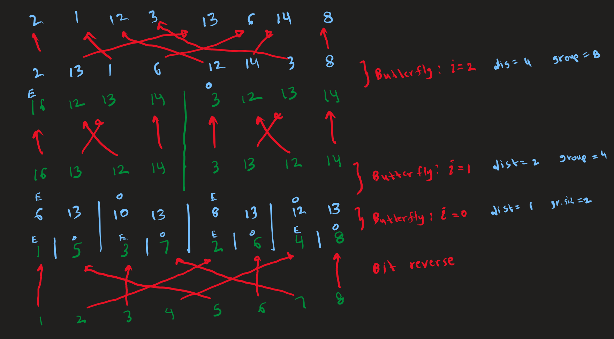
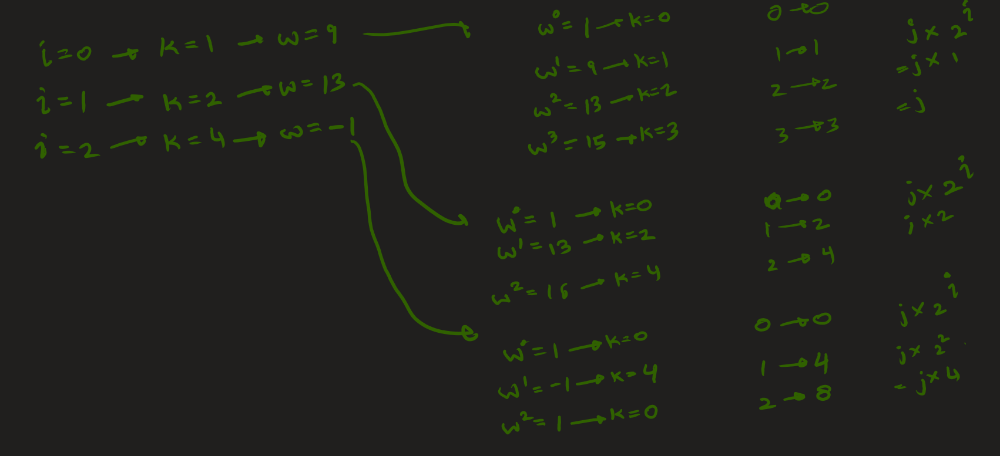
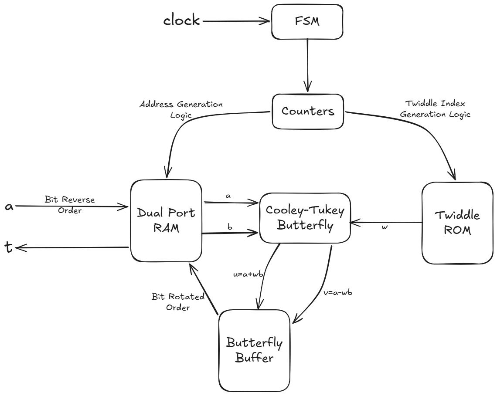
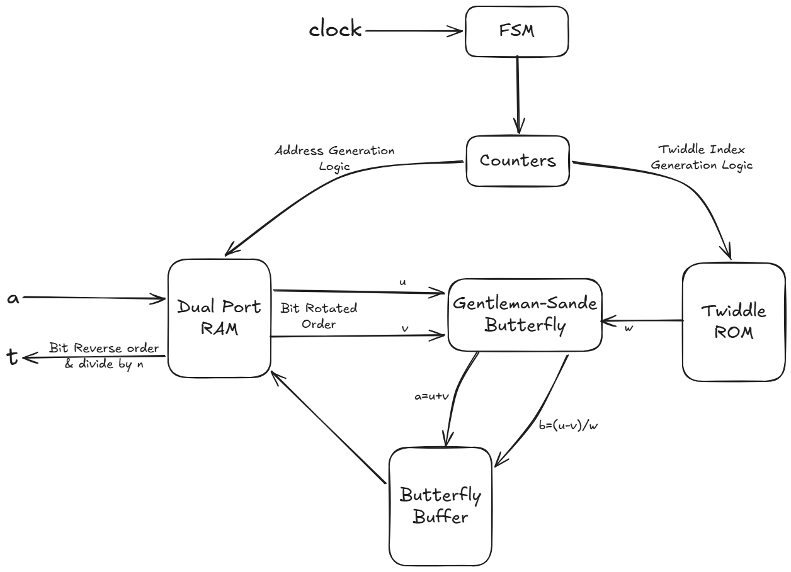
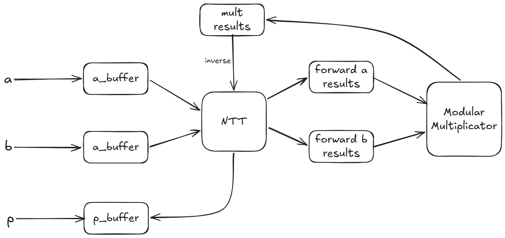
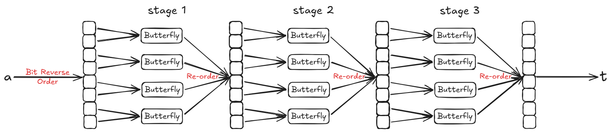
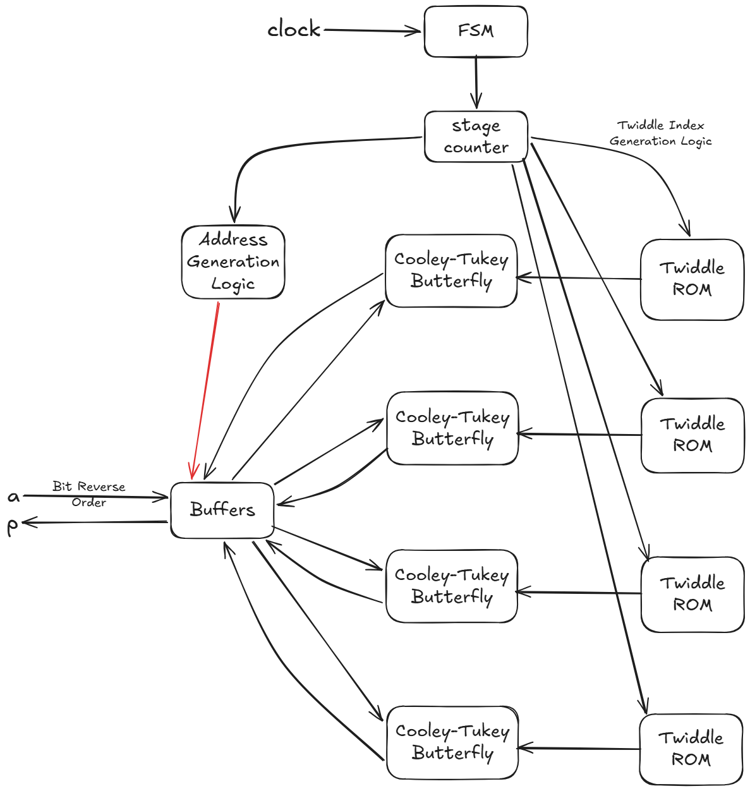

# Quick Run

Execute the following command to run the testbench for the NTT, which will read data from the corresponding data file and print the output.

**n=8:**
```
iverilog -g2012 -s ntt_sequential_n8_tb -o build/ntt_sequential_n8_tb.vvp modules/full_adder.v modules/full_subtractor.v modules/n_bit_adder.v modules/n_bit_subtractor.v modules/modular_reducer.v modules/modular_adder.v modules/modular_subtractor.v modules/modular_multiplicator.v modules/cooley_tukey_butterfly.v modules/gentleman-sande-butterfly.v modules/bit_reverser.v modules/twiddle_rom.v modules/sequential/dual_port_ram.v modules/sequential/NTT.v testbenches/ntt_sequential_n8_tb.v; vvp build/ntt_sequential_n8_tb.vvp
```

**n=256:**

```
iverilog -g2012 -s ntt_sequential_kyber_tb -o build/ntt_sequential_kyber_tb.vvp modules/full_adder.v modules/full_subtractor.v modules/n_bit_adder.v modules/n_bit_subtractor.v modules/modular_reducer.v modules/modular_adder.v modules/modular_subtractor.v modules/modular_multiplicator.v modules/cooley_tukey_butterfly.v modules/gentleman-sande-butterfly.v modules/bit_reverser.v modules/twiddle_rom.v modules/sequential/dual_port_ram.v modules/sequential/NTT.v testbenches/ntt_sequential_kyber_tb.v; vvp build/ntt_sequential_kyber_tb.vvp
```

You can find the complete design and implementation details below.

# Hardware Number Theoretic Transform Implementation

This hardware NTT is implemented as a [prerequisite task for the secure computing PhD position at Archlab](https://archlabx.github.io/apply/task26fhe/).

The task only requires the implementation of a Number Theoretic Transform (henceforth abbreviated to NTT), but I have extended that to implementing a polynomial multiplicator in a cyclic polynomial ring combining an NTT and an inverse NTT (henceforth abbreviated to iNTT)

Also, the task only requires the implementation of a heavily sequential version of NTT, but for the sake of answering some of the follow up questions, I have implemented 3 variations of NTT and the corresponding polynomial multiplicators.

1. Purely combinational
2. Heavily sequential (The architecture encouraged in the task description)
3. A mix of the above

## Modules

I started the implementation from the basic building blocks. In some instances I have opted for not using these but using the built-in modules from Verilog. I will clearly mention them with each module.

All modules are parameterized, so generating hardware with larger bit widths, or different moduli is as trivial as finding the values of the parameters. Following is a list of parameters.
- bit width
- modulus
- root (root of unity at k=0)
- n (Transform size)
- n_inverse (Inverse of n modulo the modulus)

The modulus is a parameter because most systems work with a constant modulus. n_inverse can also be calculated during the compile time using the modulus and n, rather than providing it as a parameter.

The testbench commands below assume [Icarus Verilog](https://steveicarus.github.io/iverilog/) is installed, and should be run from the main source directory.

### Helper modules
These are the building blocks that are required for the main modules.

#### [Full adder](modules/full_adder.v)
A simple combinational implementation of a full adder with carries.
```
iverilog -g2012 -s full_adder_tb -o full_adder_tb.vvp modules/full_adder.v testbenches/full_adder_tb.v; vvp full_adder_tb.vvp
```

#### [n-bit adder](modules/n_bit_adder.v)
A parameterized adder using `n` full adders.
```
iverilog -g2012 -s four_bit_adder_tb -o four_bit_adder_tb.vvp modules/full_adder.v modules/n_bit_adder.v testbenches/n_bit_adder_tb.v; vvp four_bit_adder_tb.vvp
```

#### [Modular Reducer](modules/modular_reducer.v)
A modular reducer using Barett Reduction. Using Barrett Reduction, we can reduce any number `a` modulo `n` as long as `0 ≤ a ≤ n²`. This assumption is safe in a system where all operations are done modulo `n`, as `n²` is the largest result a single arithmetic operation can yield. 

As long as the modulus is known during compile-time, we can reduce by doing only multiplications, bit right-shifts, and subtractions during runtime. Also this is a combinational circuit, which is advantageous with regards to performance.
```
iverilog -g2012 -s modular_reducer_tb -o modular_reducer_tb.vvp modules/modular_reducer.v testbenches/modular_reducer_tb.v; vvp modular_reducer_tb.vvp
```

#### [Modular Adder](modules/modular_adder.v)
The n-bit adder and the modular reducer is combined to implement a combinational modular adder. Both inputs of the adder are first reduced, then added, then reduced again. The reductions of the inputs may not be necessary in a production system where behaviours of all other components are known.
```
iverilog -g2012 -s modular_adder_tb -o modular_adder_tb.vvp modules/full_adder.v modules/n_bit_adder.v modules/modular_reducer.v modules/modular_adder.v testbenches/modular_adder_tb.v; vvp modular_adder_tb.vvp
```

#### [Modular Subtractor](modules/modular_subtractor.v)
The modular subtractor is built using the same principles as the Modular Adder, but by using complementary building blocks. A [Full Subtractor](modules/full_subtractor.v) and an [n-bit Subtractor](modules/n_bit_subtractor.v) is used along with the Modular Reducer.
```
iverilog -g2012 -s modular_subtractor_tb -o modular_subtractor_tb.vvp modules/full_adder.v modules/full_subtractor.v modules/n_bit_adder.v modules/n_bit_subtractor.v modules/modular_reducer.v modules/modular_subtractor.v testbenches/modular_subtractor_tb.v; vvp modular_subtractor_tb.vvp
```

#### [n-bit Multiplicator](modules/n_bit_multiplier.v)
This is the naive approach to implementing a multiplier. It calculates partial products and adds them using a series of n-bit adders, like when multiplying by hand.

Although this module works, I will not use it for further implementations due to the following reasons.
- By simply using `*` Verilog generates a multiplier circuit that is optimized by techniques such as Karatsuba multiplication and many others, that are much better than this version.
- Using `*` for multiplication makes the verilog code much simpler to read as there is one less module to instantiate. Since this task is about NTT, the multiplier makes little difference.
```
iverilog -g2012 -s n_bit_multiplier_tb -o n_bit_multiplier_tb.vvp modules/full_adder.v modules/n_bit_adder.v modules/n_bit_multiplier.v testbenches/n_bit_multiplier_tb.v; vvp n_bit_multiplier_tb.vvp
```

#### [Modular Multiplicator](modules/modular_multiplicator.v)
Uses the same approach as other modular arithmetic modules. Reduce the inputs, multiply them using `*`, then reduce the result again.
```
iverilog -g2012 -s modular_multiplicator_tb -o modular_multiplicator_tb.vvp modules/modular_reducer.v modules/modular_multiplicator.v testbenches/modular_multiplicator_tb.v; vvp modular_multiplicator_tb.vvp
```

#### [Cooley-Tukey Butterfly](modules/cooley_tukey_butterfly.v)
Use the Modular adder, Modular multiplicator, and modular subtractor to implement 
```
u = a + ωb
v = a - ωb
```

```
iverilog -g2012 -s cooley_tukey_butterfly_tb -o cooley_tukey_butterfly_tb.vvp modules/full_adder.v modules/full_subtractor.v modules/n_bit_adder.v modules/n_bit_subtractor.v modules/modular_reducer.v modules/modular_adder.v modules/modular_subtractor.v modules/modular_multiplicator.v modules/cooley_tukey_butterfly.v testbenches/cooley_tukey_butterfly_tb.v; vvp cooley_tukey_butterfly_tb.vvp
```

#### [Gentleman-Sande Butterfly](modules/gentleman-sande-butterfly.v)
The inverse of the Cooley-Tukey Butterfly. Equation-wise, the actual inverse would be
```
a = (u+v)/2
b = (u-v)/2ω
```
But in the actual implementation we omit the division by 2. At the end of the iNTT process, we multiply the results by `n_inverse` which is equivalent to dividing by 2 in each step. 

```
iverilog -g2012 -s gentleman_sande_butterfly_tb -o gentleman_sande_butterfly_tb.vvp modules/full_adder.v modules/full_subtractor.v modules/n_bit_adder.v modules/n_bit_subtractor.v modules/modular_reducer.v modules/modular_adder.v modules/modular_subtractor.v modules/modular_multiplicator.v modules/gentleman-sande-butterfly.v testbenches/gentleman_sande_butterfly_tb.v; vvp gentleman_sande_butterfly_tb.vvp
```

#### [Twiddle ROM](modules/twiddle_rom.v)
This will calculate all the twiddle factors during compile-time and store them in registers.
```
iverilog -g2012 -s twiddle_rom_tb -o twiddle_rom_tb.vvp modules/twiddle_rom.v testbenches/twiddle_rom_tb.v; vvp twiddle_rom_tb.vvp
```

#### [Dual Port RAM](modules/sequential/dual_port_ram.v)
A set of registers with 2 IO ports so it's possible to either read or write to/from 2 memory addresses at once. This is useful because butterfly units use 2 values as input at once and outputs 2 values.
```
iverilog -g2012 -s dual_port_ram_tb -o dual_port_ram_tb.vvp modules/sequential/dual_port_ram.v testbenches/dual_port_ram_tb.v; vvp dual_port_ram_tb.vvp
```

### Main Modules

The top-level NTT and polynomial multiplicator tests use four generated data files:

- `testbenches/data/ntt_n8.mem`
- `testbenches/data/ntt_kyber.mem`
- `testbenches/data/poly_n8.mem`
- `testbenches/data/poly_kyber.mem`

Regenerate them with:
```
python testbenches/generate_test_data.py
```

Each NTT data file has 20 cases: 15 forward NTT cases followed by 5 inverse NTT cases. Each polynomial multiplication data file has 20 cases. The top-level benches are split by implementation style and size:

```
testbenches/ntt_sequential_n8_tb.v
testbenches/ntt_sequential_kyber_tb.v
testbenches/ntt_mixed_n8_tb.v
testbenches/ntt_mixed_kyber_tb.v
testbenches/ntt_combinational_n8_tb.v
testbenches/ntt_combinational_kyber_tb.v
testbenches/poly_sequential_n8_tb.v
testbenches/poly_sequential_kyber_tb.v
testbenches/poly_mixed_n8_tb.v
testbenches/poly_mixed_kyber_tb.v
testbenches/poly_combinational_n8_tb.v
testbenches/poly_combinational_kyber_tb.v
```

#### [Sequential NTT](modules/sequential/NTT.v)
This sequential module will convert a polynomial from the coefficient representation to the evaluation form. It also supports converting back from the evaluation form to the coefficient form, essentially an iNTT, by setting the `inverse_` bit to `1`. 

**n=8:**
```
iverilog -g2012 -s ntt_sequential_n8_tb -o build/ntt_sequential_n8_tb.vvp modules/full_adder.v modules/full_subtractor.v modules/n_bit_adder.v modules/n_bit_subtractor.v modules/modular_reducer.v modules/modular_adder.v modules/modular_subtractor.v modules/modular_multiplicator.v modules/cooley_tukey_butterfly.v modules/gentleman-sande-butterfly.v modules/bit_reverser.v modules/twiddle_rom.v modules/sequential/dual_port_ram.v modules/sequential/NTT.v testbenches/ntt_sequential_n8_tb.v; vvp build/ntt_sequential_n8_tb.vvp
```

**n=256:**

```
iverilog -g2012 -s ntt_sequential_kyber_tb -o build/ntt_sequential_kyber_tb.vvp modules/full_adder.v modules/full_subtractor.v modules/n_bit_adder.v modules/n_bit_subtractor.v modules/modular_reducer.v modules/modular_adder.v modules/modular_subtractor.v modules/modular_multiplicator.v modules/cooley_tukey_butterfly.v modules/gentleman-sande-butterfly.v modules/bit_reverser.v modules/twiddle_rom.v modules/sequential/dual_port_ram.v modules/sequential/NTT.v testbenches/ntt_sequential_kyber_tb.v; vvp build/ntt_sequential_kyber_tb.vvp
```

For simplicity's sake I will only explain the forward case, but the inverse case is similar. It's just a matter of swapping the Cooley-Tukey Butterflies with the Gentleman-Sande Butterflies, inverting the logic, and multiplying by `n_inverse` at the end.

##### State Machine

This NTT works via a FSM (Finite State Machine). The states are as follows.
1. STATE_IDLE - Waits until the input enable signal is `1`.
2. STATE_LOAD - Loads data from the `a` input one number per clock cycle. In the case of `n=8`, it takes 8 clock cycles to load all the input data.
3. STATE_PROCESS - Converts the numbers into the evaluation form and stores them in a buffer. We cannot store them directly into the RAM because the current state of the RAM is still required for the next iterations of the current stage.
4. STATE_WRITEBACK - Write the contents of the buffer back into the RAM 2 at a time.
5. STATE_OUTPUT - Loads data from the RAM to `t` output one number per clock cycle.

##### Address Generation

There are some address generation logic that goes into the design of an NTT as the data order changes each stage, as well as before and after input.

1. I start thinking about the logic from the leaves of the recursion tree of NTT up to the root. So the first stage is the leaves. The original data must be re-ordered to be in bit-reverse order. Then the even and odd parts of the first stage are next to each other. Rather than doing the re-ordering explicitly, I have preemtpively stored the input values in the RAM in the bit-reverse order. This is a one time operation, after which we can process each stage, one by one. For reversing the bits I have created a [harware bit reverser](modules/bit_reverser.v), but a function would have worked more easily.

2. Next, for each stage, we apply the butterflies, then re-order the results. This can be done in a multitude of ways, the approach I have found is as follows. For `n=8` each stage has 4 butterflies. Apply them in order and store the values in order. Then re-order by rotating right the `i` least significant bits of the index, where `i` is the current stage. Bit rotation is done via a function.

3. Finally we have the Twiddle Index Generation. For this I'm using a formula I derived by observation. `twiddle_address = j * (n >> (i+1))` where `j` is the current butterfly index within the current butterfly group, and `i` is the current stage.

I generated the above logic by writing out a full NTT conversion by hand and figuring out the logic. You can find my workings below.



Note that there is no re-ordering happening after the butterfly of the first stage. That's because the re-ordering as I've mentioned above is a rotation of the least significant `i` bits, and the rotation of 1 bit doesn't change the number.

The workings for Twiddle Index Generation Logic are as follows.



You can find below a simplfied data-path diagram of the forward NTT and the inverse NTT.

<div align="center">

</div>

<div align="center">

</div>

#### [Sequential Polynomial Multiplicator](modules/sequential/polynomial_multiplicator_sequential.v)

This will use the sequential NTT module and multiply 2 polynomials in a cyclic polynomial ring in `O(nlogn)` time and give us the result. This module is logically simple, but has more states than the NTT.

**n=8:**
```
iverilog -g2012 -s poly_sequential_n8_tb -o build/poly_sequential_n8_tb.vvp modules/full_adder.v modules/full_subtractor.v modules/n_bit_adder.v modules/n_bit_subtractor.v modules/modular_reducer.v modules/modular_adder.v modules/modular_subtractor.v modules/modular_multiplicator.v modules/cooley_tukey_butterfly.v modules/gentleman-sande-butterfly.v modules/bit_reverser.v modules/twiddle_rom.v modules/sequential/dual_port_ram.v modules/sequential/NTT.v modules/sequential/polynomial_multiplicator_sequential.v testbenches/poly_sequential_n8_tb.v; vvp build/poly_sequential_n8_tb.vvp
```

**n=256:**

```
iverilog -g2012 -s poly_sequential_kyber_tb -o build/poly_sequential_kyber_tb.vvp modules/full_adder.v modules/full_subtractor.v modules/n_bit_adder.v modules/n_bit_subtractor.v modules/modular_reducer.v modules/modular_adder.v modules/modular_subtractor.v modules/modular_multiplicator.v modules/cooley_tukey_butterfly.v modules/gentleman-sande-butterfly.v modules/bit_reverser.v modules/twiddle_rom.v modules/sequential/dual_port_ram.v modules/sequential/NTT.v modules/sequential/polynomial_multiplicator_sequential.v testbenches/poly_sequential_kyber_tb.v; vvp build/poly_sequential_kyber_tb.vvp
```

1. STATE_IDLE - Waits until the input enable signal is `1`.
2. STATE_LOAD_A - Loads the coefficients of the first polynomial one by one.
3. STATE_WAIT_TRANS_A - Waits until the NTT has finished converting `a` into the evaluation form. When the `en_out` of the NTT becomes `1`, it stores the result in `a_buffer` one by one.
4. STATE_LOAD_B - Loads the coefficients of the second polynomial one by one.
5. STATE_WAIT_TRANS_B - Waits until the NTT has finished converting `b` into the evaluation form. When the `en_out` of the NTT becomes `1`, it stores the result in `b_buffer` one by one.
6. STATE_MULT - Multiplies the contents of `a_buffer` and `b_buffer` component-wise using a single modular multiplicator module, and stores them in `mult_results`.
7. STATE_LOAD_INV - Loads the contents of `mult_results` into the NTT for converting back into the coefficient form.
8. STATE_WAIT_INV_TRANS - Waits until the inversion is done.

<div align="center">

</div>

#### [Combinational NTT](modules/NTT_combinational.v)

I created this module for educational purposes. I started with this because it allowed me to focus on the logical aspects of the implementation which is the difficult part, without worrying about the timing, FSM, and clocking aspects of it.

**n=8:**
```
iverilog -g2012 -s ntt_combinational_n8_tb -o build/ntt_combinational_n8_tb.vvp modules/full_adder.v modules/full_subtractor.v modules/n_bit_adder.v modules/n_bit_subtractor.v modules/modular_reducer.v modules/modular_adder.v modules/modular_subtractor.v modules/modular_multiplicator.v modules/cooley_tukey_butterfly.v modules/gentleman-sande-butterfly.v modules/twiddle_rom.v modules/NTT_combinational.v modules/inverse_NTT_combinational.v testbenches/ntt_combinational_n8_tb.v; vvp build/ntt_combinational_n8_tb.vvp
```

**n=256:**

```
iverilog -g2012 -s ntt_combinational_kyber_tb -o build/ntt_combinational_kyber_tb.vvp modules/full_adder.v modules/full_subtractor.v modules/n_bit_adder.v modules/n_bit_subtractor.v modules/modular_reducer.v modules/modular_adder.v modules/modular_subtractor.v modules/modular_multiplicator.v modules/cooley_tukey_butterfly.v modules/gentleman-sande-butterfly.v modules/twiddle_rom.v modules/NTT_combinational.v modules/inverse_NTT_combinational.v testbenches/ntt_combinational_kyber_tb.v; vvp build/ntt_combinational_kyber_tb.vvp
```

There is absolutely no hardware re-using with this approach so the final synthesized hardware has extremely high area.

When this design is synthesized to the scale of Kyber, with a Transform size of 256, each stage has 128 butterflies, and there are 8 stages. That's a lot of hardware.

The following diagram is when `n=8`.



The [combinational inverse NTT](modules/inverse_NTT_combinational.v) is a separate module. There is also a [Combinational Polynomial Multiplicator](modules/polynomial_multiplicator.v).

**n=8:**
```
iverilog -g2012 -s poly_combinational_n8_tb -o build/poly_combinational_n8_tb.vvp modules/full_adder.v modules/full_subtractor.v modules/n_bit_adder.v modules/n_bit_subtractor.v modules/modular_reducer.v modules/modular_adder.v modules/modular_subtractor.v modules/modular_multiplicator.v modules/cooley_tukey_butterfly.v modules/gentleman-sande-butterfly.v modules/twiddle_rom.v modules/NTT_combinational.v modules/inverse_NTT_combinational.v modules/polynomial_multiplicator.v testbenches/poly_combinational_n8_tb.v; vvp build/poly_combinational_n8_tb.vvp
```

**n=256:**

```
iverilog -g2012 -s poly_combinational_kyber_tb -o build/poly_combinational_kyber_tb.vvp modules/full_adder.v modules/full_subtractor.v modules/n_bit_adder.v modules/n_bit_subtractor.v modules/modular_reducer.v modules/modular_adder.v modules/modular_subtractor.v modules/modular_multiplicator.v modules/cooley_tukey_butterfly.v modules/gentleman-sande-butterfly.v modules/twiddle_rom.v modules/NTT_combinational.v modules/inverse_NTT_combinational.v modules/polynomial_multiplicator.v testbenches/poly_combinational_kyber_tb.v; vvp build/poly_combinational_kyber_tb.vvp
```

#### [Mixed NTT](modules/mixed/NTT.v)

The sequential NTT can be considered one end of a spectrum. It does everything sequentially. Reads data, performs calculations, outputs data, all one by one. But this is very efficient with regards to hardware area, but inefficient with regards to latency. (Throughput can be somewhat increased by pipelining.)

**n=8:**
```
iverilog -g2012 -s ntt_mixed_n8_tb -o build/ntt_mixed_n8_tb.vvp modules/full_adder.v modules/full_subtractor.v modules/n_bit_adder.v modules/n_bit_subtractor.v modules/modular_reducer.v modules/modular_adder.v modules/modular_subtractor.v modules/modular_multiplicator.v modules/cooley_tukey_butterfly.v modules/gentleman-sande-butterfly.v modules/twiddle_rom.v modules/mixed/NTT.v modules/mixed/inverse_NTT.v testbenches/ntt_mixed_n8_tb.v; vvp build/ntt_mixed_n8_tb.vvp
```

**n=256:**

```
iverilog -g2012 -s ntt_mixed_kyber_tb -o build/ntt_mixed_kyber_tb.vvp modules/full_adder.v modules/full_subtractor.v modules/n_bit_adder.v modules/n_bit_subtractor.v modules/modular_reducer.v modules/modular_adder.v modules/modular_subtractor.v modules/modular_multiplicator.v modules/cooley_tukey_butterfly.v modules/gentleman-sande-butterfly.v modules/twiddle_rom.v modules/mixed/NTT.v modules/mixed/inverse_NTT.v testbenches/ntt_mixed_kyber_tb.v; vvp build/ntt_mixed_kyber_tb.vvp
```

On the other hand the combinational NTT only takes one pulse to do all its work. But this is very inefficient with regards to hardware area, and very tricky to use due to propagation delays.

Any hardware implementation we do falls somwhere within this spectrum. Which parts work sequentially and which parts work parallelly depends on the design.

The mixed NTT is one such design that parallellizes each stage. So when `n=8`, there are 3 stages, it completes the conversion in 3 clock cycles. It uses 4 butterfly units among other hardware. The 3 clock cycles are not counting IO, but this is still much better with regards to latency when compared to the pure sequential design. In the Kyber scale, `n=256`, we need 128 butterflies. This is still better than `128*8` butterflies needed in the pure combinational approach. Whether this approach is still practically valid or not depends on other engineering constraints of the specific scenario.

<div align="center">

</div>

There is also the [mixed Inverse NTT](modules/mixed/inverse_NTT.v) and the [polynomial multiplicator using the mixed NTT](modules/mixed/polynomial_multiplicator.v).

**n=8:**
```
iverilog -g2012 -s poly_mixed_n8_tb -o build/poly_mixed_n8_tb.vvp modules/full_adder.v modules/full_subtractor.v modules/n_bit_adder.v modules/n_bit_subtractor.v modules/modular_reducer.v modules/modular_adder.v modules/modular_subtractor.v modules/modular_multiplicator.v modules/cooley_tukey_butterfly.v modules/gentleman-sande-butterfly.v modules/twiddle_rom.v modules/mixed/NTT.v modules/mixed/inverse_NTT.v modules/mixed/polynomial_multiplicator.v testbenches/poly_mixed_n8_tb.v; vvp build/poly_mixed_n8_tb.vvp
```

**n=256:**

```
iverilog -g2012 -s poly_mixed_kyber_tb -o build/poly_mixed_kyber_tb.vvp modules/full_adder.v modules/full_subtractor.v modules/n_bit_adder.v modules/n_bit_subtractor.v modules/modular_reducer.v modules/modular_adder.v modules/modular_subtractor.v modules/modular_multiplicator.v modules/cooley_tukey_butterfly.v modules/gentleman-sande-butterfly.v modules/twiddle_rom.v modules/mixed/NTT.v modules/mixed/inverse_NTT.v modules/mixed/polynomial_multiplicator.v testbenches/poly_mixed_kyber_tb.v; vvp build/poly_mixed_kyber_tb.vvp
```

## Analysis

We can use the following commands to calculate how much hardware area is occupied by each NTT implementation. You will need to [install yosys on your system](https://yosyshq.net/yosys/download.html).

Please note that the hardware area of these modules are higher than desirable because they haven't been optimized properly. As the task is about the understanding cryptographical algorithms and implementing them in hardware, I did not focus too much on optimization. But it is simply a matter of time.

1. For the sequential NTT `n=8` : 56364 Cells : 24 clock cycles
```
yosys -p "read_verilog -sv modules/full_adder.v modules/full_subtractor.v modules/n_bit_adder.v modules/n_bit_subtractor.v modules/modular_reducer.v modules/modular_adder.v modules/modular_subtractor.v modules/modular_multiplicator.v modules/cooley_tukey_butterfly.v modules/gentleman-sande-butterfly.v modules/bit_reverser.v modules/twiddle_rom.v modules/sequential/dual_port_ram.v modules/sequential/NTT.v; hierarchy -check -top NTT; synth -top NTT -noabc; stat -top NTT"
```

2. For the mixed NTT `n=8` : 63323 Cells : 3 clock cycles
```
yosys -p "read_verilog -sv modules/full_adder.v modules/full_subtractor.v modules/n_bit_adder.v modules/n_bit_subtractor.v modules/modular_reducer.v modules/modular_adder.v modules/modular_subtractor.v modules/modular_multiplicator.v modules/cooley_tukey_butterfly.v modules/gentleman-sande-butterfly.v modules/twiddle_rom.v modules/mixed/NTT.v; hierarchy -check -top NTT_mixed; synth -top NTT_mixed -noabc; stat -top NTT_mixed"
```

3. For the combinational NTT `n=8` : 148608 Cells : No Clock
```
yosys -p "read_verilog -sv modules/full_adder.v modules/full_subtractor.v modules/n_bit_adder.v modules/n_bit_subtractor.v modules/modular_reducer.v modules/modular_adder.v modules/modular_subtractor.v modules/modular_multiplicator.v modules/cooley_tukey_butterfly.v modules/twiddle_rom.v modules/NTT_combinational.v; hierarchy -check -top ntt_combinational; synth -top ntt_combinational -noabc; stat -top ntt_combinational"
```

As you can see, more parallel the hardware is, less clock cycles it need, but more hardware area it requires, as well as more attention to propagation delays and timing issues.
